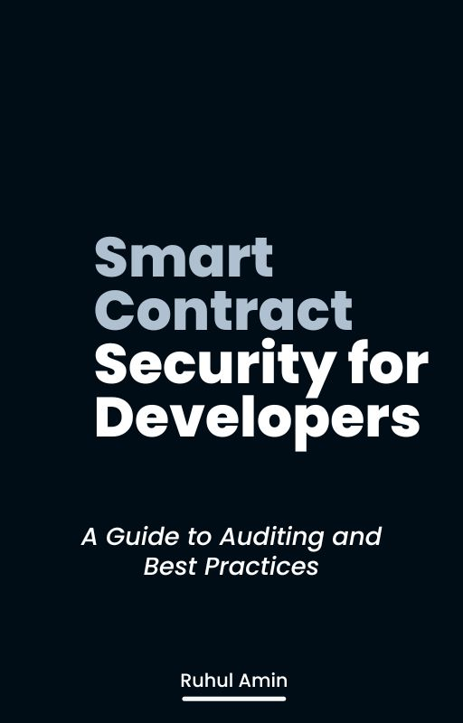

# **Smart Contract Security for Developers: A Guide to Auditing and Best Practices**  

Welcome to the official repository for **"Smart Contract Security for Developers: A Guide to Auditing and Best Practices"**. This book is dedicated to helping developers understand, audit, and secure smart contracts for blockchain applications.  
 

  

 

## **About the Book**  
Smart contracts are at the heart of decentralized applications, enabling trustless systems across industries. However, vulnerabilities in these contracts can lead to catastrophic financial losses and reputational damage. This book provides:  
- A comprehensive guide to smart contract security fundamentals.  
- Practical methodologies for auditing and identifying vulnerabilities.  
- Best practices for secure development and post-deployment strategies.  

## **Who This Book Is For**  
This book is tailored for:  
- Blockchain developers seeking to enhance their understanding of security.  
- Auditors aiming to refine their methodologies.  
- Students and enthusiasts eager to dive into secure blockchain development.  

## **Repository Features**  
This repository contains:  
- **Chapter drafts**: Each chapter is added as it is written.  
- **Code examples**: Practical examples of secure and insecure code to learn from.  
- **Exercises**: Interactive exercises to practice your auditing and coding skills.  
- **Resources**: References and links to tools, frameworks, and further reading.  

## **How to Use This Repository**  
1. **Follow Along**: Chapters will be published incrementally. You can read and review them as they’re released.  
2. **Contribute**: Found a typo, error, or have suggestions? Feel free to open an issue or submit a pull request.  
3. **Explore Code**: Use the provided examples and exercises to reinforce your understanding.  

## **Planned Table of Contents**  
1. **Introduction to Smart Contract Security**  
2. **Blockchain Basics for Auditors**  
3. **Tools and Setup for Auditing**  
4. **Common Vulnerabilities in Smart Contracts**  
5. **Advanced Vulnerabilities and Attack Vectors**  
6. **Auditing Methodology**  
7. **Secure Coding Practices**  
8. **Case Studies and Future Trends**  

## **Contributing**  
We welcome contributions! Here's how you can help:  
1. Fork the repository.  
2. Create a new branch for your changes (`git checkout -b chapter-name`).  
3. Commit your changes (`git commit -m "Added a new example for reentrancy"`) and push to your branch (`git push origin chapter-name`).  
4. Submit a pull request explaining your changes.  

## **License**  
This repository is licensed under the [MIT License](LICENSE).  

## **Stay Updated**  
- **Follow** this repository to stay updated on new chapters and examples.  
- Join the conversation in the Issues and Discussions tab.  

Let’s work together to make smart contract development more secure!  
